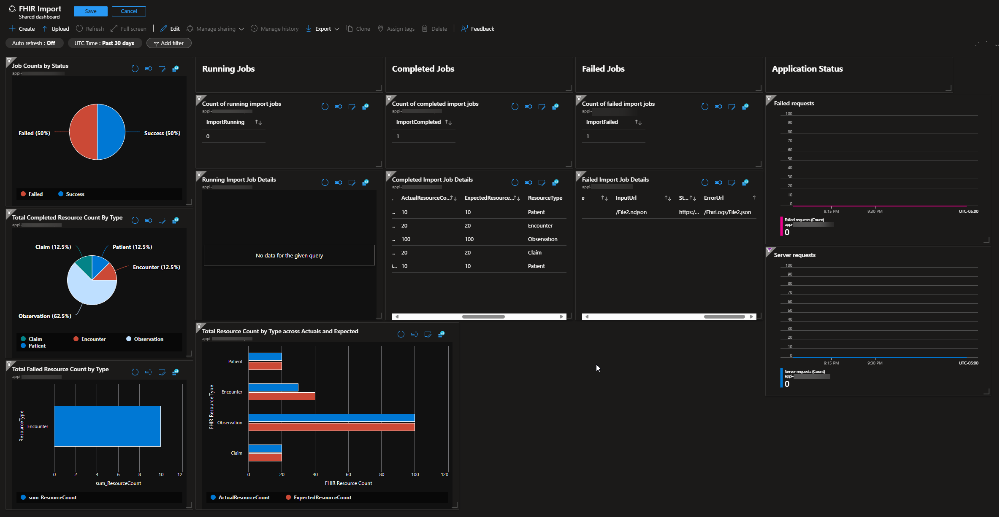

# FHIR Import Dashboard

Native dashboard using Azure Dashboard to monitor Azure Health Data Services FHIR import jobs.



## Components

1. Application Insights - Used to track custom telemetry events generated from checking the FHIR import status endpoint.
1. Azure Dashboard - Used to display queries and visualizations representing the status of jobs and various counts.

## Visualizations

Various tiles are used to represent parts of the import jobs and the application generating the metrics.

1. Job count by status
1. TOtal completed resource count by type
1. Total failed resource count by type
1. Count of running import jobs
1. Count of completed import jobs
1. Count of failed import jobs
1. Running/Completed/Failed job details
1. Total resource count by type across actuals and expected
1. Status about the custom application used to generate dashboard data.

## Deploy Dashboard

- Access to an existing application insights instance with data will be required.
- Confirm parameter values in [azuredeploy.parameters.json](/deploy/iac/azuredeploy.parameters.json)
- Deploy [main.bicep](/deploy/iac/main.bicep) using Azure CLI

```bash
az deployment group create --resource-group RESOURCE_GROUP --template-file main.bicep --parameters @azuredeploy.parameters.json
```

## Report Schema

Represents the data to be stored in Log Analytics.

|    <br>Property                   	|    <br>Data Type    	|    <br>Notes                                                                                               	|
|-----------------------------------	|---------------------	|------------------------------------------------------------------------------------------------------------	|
|    <br>Import Mode                	|    <br>String       	|    <br>Separates initial vs incremental load report.                                                       	|
|    <br>CorrelationId              	|    <br>Guid         	|    <br>Identifier used to correlate the import back to a given   ADF run.                                  	|
|    <br>Timestamp                  	|    <br>DateTime     	|    <br>It is used to identify the time the import completed for   the given resource type.                 	|
|    <br>Expected resource count    	|    <br>Integer      	|    <br>Expected count of resources imported. This can be the # of   files imported by the ADF pipeline.    	|
|    <br>Status Url                 	|    <br>Uri          	|    <br>The status url returned by the Azure FHIR service import   operation.                               	|
|    <br>Import Id                  	|    <br>Integer      	|    <br>Identifier for the import in Azure FHIR Service.                                                    	|
|    <br>Error Url                  	|    <br>Uri          	|    <br>Url to the error log if any exists.                                                                 	|
|    <br>Input Url                  	|    <br>Uri          	|    <br>Url to the input file.                                                                              	|
|    <br>Actual import count        	|    <br>Integer      	|    <br>The actual count of the resources imported for the given   type.                                    	|
|    <br>Resource type              	|    <br>String       	|    <br>The FHIR resource type such as Patient/Encounter.                                                   	|

### Sample Report Schema JSON

```json
{
	"ImportId": "1",
	"ImportStatus": "Success",
	"StatusUrl": "https://FHIR-SERVICE.fhir.azurehealthcareapis.com/_operations/import/1",
	"CorrelationId": "c3811f97-b901-4327-b65e-d9a1260070a6",
	"InputUrl": "/File1.ndjson",
	"ActualResourceCount": "10",
	"ExpectedResourceCount": "10",
	"ImportMode": "Incremental",
	"ResourceType": "Patient"
}
```

## Querying Import Logs

Pie chart showing percent of completed, running, or failed import jobs.

Review the [dashboard definition](/deploy/iac/main.bicep) for additional queries.

```sql
let completed = customEvents
    | where name == "FhirImport" and tostring(customDimensions.ImportStatus) == "Success"
    | distinct
        timestamp,
        importId = tostring(customDimensions.ImportId),
        ImportStatus = tostring(customDimensions.ImportStatus)
    | order by timestamp desc;
let failed = customEvents
    | where name == "FhirImport" and tostring(customDimensions.ImportStatus) == "Failed"
    | distinct
        timestamp,
        importId = tostring(customDimensions.ImportId),
        ImportStatus = tostring(customDimensions.ImportStatus)
    | order by timestamp desc;
let running = customEvents
    | where name == "FhirImport" and tostring(customDimensions.ImportStatus) == "Running"
    | distinct
        timestamp,
        importId = tostring(customDimensions.ImportId),
        ImportStatus = tostring(customDimensions.ImportStatus)
    | order by timestamp desc;
completed
| distinct importId, ImportStatus
| extend Order=1
| join kind=leftanti running on importId
| join kind=leftanti failed on importId
| union withsource=RunningTable kind=outer      (running
    | distinct importId, ImportStatus
    | join kind=leftanti completed on importId
    | join kind=leftanti failed on importId
    | distinct importId, ImportStatus
    | extend Order=3)
| union withsource=FailedTable kind=outer      (failed
    | distinct importId, ImportStatus
    | extend Order=2)
| summarize TotalJobCount = count() by ImportStatus, Order
| sort by Order asc
| project ImportStatus, TotalJobCount
| render piechart with(title="Job Counts by Status") 
```